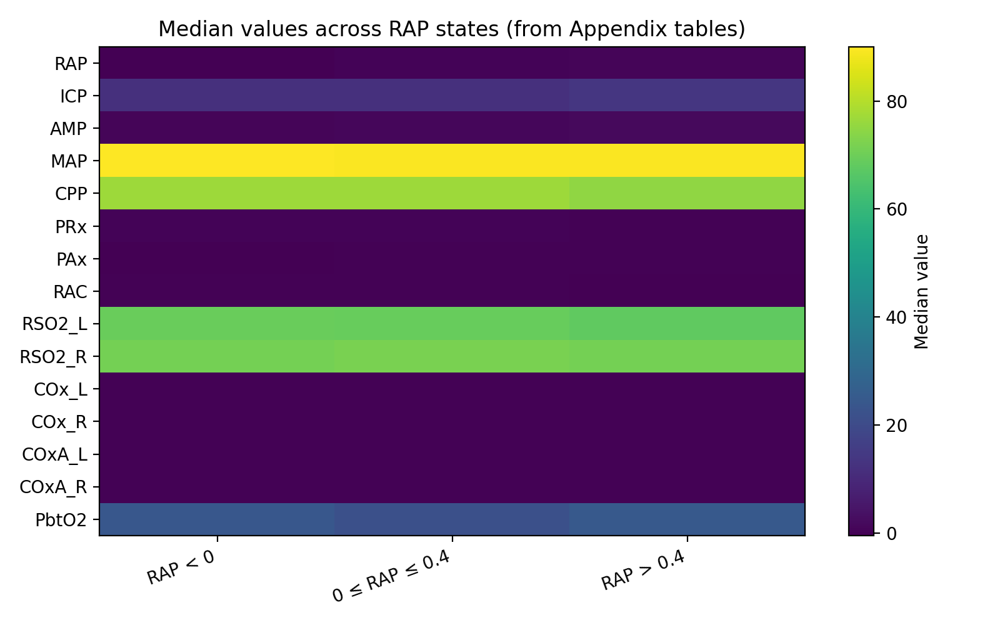
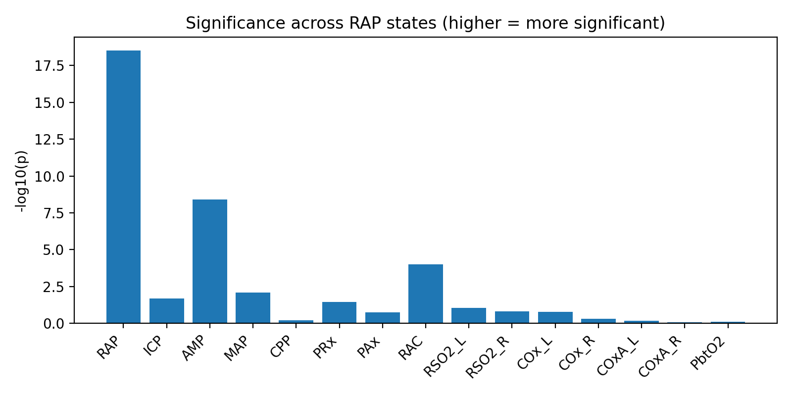
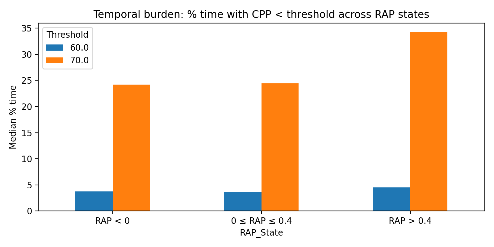
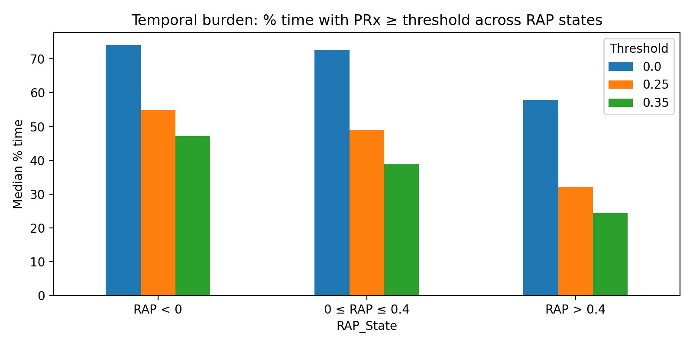

# Descriptive Relationships Between Time-series Variables

A quantitative, visually characterized analysis of physiological trends across EEG time-series variables.


<p>
  
  
  
  
  
  
</p>

## Table of Contents

- [About](#about)
- [Features](#features)
- [Data](#data)
- [Method](#method)
- [Result](#result)
- [Quick Start](#quick-start)
- [Installation](#installation)
- [Project Structure](#project-structure)
- [Associated Publication](#associated-publication)
- [Contributing](#contributing)
- [Support](#support)
- [Acknowledgments](#acknowledgments)

## About

This repository presents a descriptive analysis of the relationships between the time series signals, Compensatory Reserve Index (RAP) and multiple intracranial and cerebrovascular physiological parameters derived from multimodal neuromonitoring data. The analysis focuses on characterizing how physiological variables behave across distinct RAP-defined states of cerebral compensatory reserve.

Physiological data are stratified into ordered RAP regimes representing preserved, transitional, and impaired compensatory reserve. Descriptive statistics and comparative visualizations are used to examine shifts in central tendency, dispersion, and distributional behavior across these regimes, providing insight into how cerebral dynamics evolve with worsening compensatory capacity.

The analysis is implemented in a Jupyter Notebook environment using standard scientific Python libraries, including NumPy, Pandas, SciPy, and Matplotlib. This work is intended as a descriptive and exploratory foundation for downstream statistical testing, multivariate analysis, and time-series modeling of cerebral physiological dynamics.

## Features

* 📊 **RAP-Based Stratification**: Segments physiological data into ordered compensatory reserve states using RAP thresholds.
* 📈 **Descriptive Statistical Analysis**: Computes central tendency and dispersion metrics across RAP regimes for multiple physiological variables.
* 🔍 **Comparative Distribution Analysis**: Examines shifts in distributions and variability as cerebral compensatory reserve deteriorates.
* 🧠 **Multimodal Physiological Integration**: Analyzes RAP alongside intracranial and cerebrovascular parameters derived from multimodal neuromonitoring.
* 🎨 **Clear Visualizations**: Generates clear comparative plots for physiological interpretation and reporting.
* 🧩 **Extensible Analytical Framework**: Designed to support downstream trend testing, multivariate analysis, and time-series modeling.


## Data

The Canadian High-Resolution Traumatic Brain Injury (CAHR-TBI) Research Collaborative Data was utilized.

#### 📊 Parameters

The analysis includes RAP alongside multiple intracranial pressure (ICP) and arterial blood pressure (ABP)-derived variables, including but not limited to:

* ICP
* MAP
* CPP
* AMP
* Cerebrovascular reactivity indices (e.g., PRx, PAx, RAC)
* Additional multimodal parameters where available

## Method

#### Descriptive Analysis Workflow

```text

Descriptive and Extended Characterization of RAP–Physiology Relationships
│
├── 1. Data Preparation
│   ├── Load preprocessed multimodal neuromonitoring datasets
│   └── Handle missing values and apply basic filtering
│
├── 2. RAP-Based Stratification
│   ├── Segment data into ordered compensatory reserve states:
│   │     • RAP < 0 (preserved reserve)
│   │     • 0 ≤ RAP ≤ 0.4 (intact or transitional reserve)
│   │     • RAP > 0.4 (impaired reserve)
│
├── 3. Core Descriptive Analysis (Part 1)
│   ├── Compute central tendency metrics:
│   │     • Mean
│   │     • Median
│   ├── Quantify dispersion:
│   │     • Interquartile range (IQR)
│   │     • Variance / standard deviation
│   ├── Report sample sizes per RAP state
│   └── Establish baseline RAP-dependent physiological trends
│
├── 4. Core Comparative Visualization
│   ├── Generate comparative distribution plots across RAP states
│   └── Produce figures for core variables
│
├── 6. Statistical Comparison Across RAP States
│ ├── Apply non-parametric group comparison tests
│ │       • Across RAP-defined states
  │       • Across other parameter thresholds
│ ├── Assess statistical significance of distributional differences
│ └── Report p-values for physiological parameters
│
├── 5. Temporal Burden Analysis (Part 2)
│ └── Compute percentage of monitoring time spent:
│ │     • Within each RAP state
│ │     • Within other parameter thresholds (reverse %time spent)

```

#### 🧠 RAP-Based Physiological Stratification

Physiological data are stratified into three RAP regimes:

* **RAP < 0**
  Preserved or optimal cerebral compensatory reserve

* **0 ≤ RAP ≤ 0.4**
  Transitional or intermediate compensatory reserve

* **RAP > 0.4**
  Impaired cerebral compensatory reserve


## Result

#### 📈 Key Observations

* Several physiological variables demonstrate **progressive shifts** across RAP regimes.
* Dispersion of key parameters often increases in the **RAP > 0.4** state, consistent with impaired autoregulatory control.
* Not all parameters exhibit monotonic behavior, highlighting the complexity of multimodal cerebral physiology.

These findings motivate formal trend testing and multivariate analysis in downstream work.

### Piecewise Linear Regression

#### RAP vs Different Parameters

<table>
  <tr>
    <td></td>
    <td></td>
  </tr>
  <tr>
    <td align="center">RAP vs ICP</td>
    <td align="center">RAP vs PRx</td>
  </tr>
</table>

#### Lower Resolutions (RAP vs ICP)

<table>
  <tr>
    <td></td>
    <td></td>
  </tr>
  <tr>
    <td align="center">1-hour</td>
    <td align="center">1-day</td>
  </tr>
</table>

### Boxplots

#### RAP vs Different Parameters

<table>
  <tr>
    <td></td>
    <td></td>
  </tr>
  <tr>
    <td align="center">RAP vs ICP</td>
    <td align="center">RAP vs PRx</td>
  </tr>
</table>

#### Lower Resolutions (RAP vs ICP)

<table>
  <tr>
    <td></td>
    <td></td>
  </tr>
  <tr>
    <td align="center">1-hour</td>
    <td align="center">1-day</td>
  </tr>
</table>

---

### Median physiology measures across the RAP states with formal comparison 
This heatmap summarizes median values of physiological parameters across RAP-defined states.



### Statistical significance across RAP states
Bars represent −log₁₀(p-values) from non-parametric group comparisons across RAP states.



Corresponding table [Median Physiology Across RAP States](tables/median_physiology_RAP_states.csv)<br>

### % time spent within the thresholds of the parameters (Example: CPP, PRx) across the RAP states

CPP threshold: 60, 70 mmHg, PRx threshold: 0, 0.25, 0.35

<table>
  <tr>
    <td></td>
    <td></td>
  </tr>
  <tr>
    <td align="center">CPP</td>
    <td align="center">PRx</td>
  </tr>
</table>

Corresponding table [% time spent within the thresholds of the parameters](tables/time_spent_within_threholds.pdf)<br>

---

# Quick Start

Clone the repository and run the main script:

```bash
git clone https://github.com/Abrar-Islam-Oitijjho/Descriptive-Relationships-Between-Time-series-Variables.git
cd Descriptive-Relationships-Between-Time-series-Variables
pip install -r requirements.txt
jupyter notebook descriptive_relationships_part2.ipynb
```

## Installation

### 🛠 Requirements

The notebook is written in Python and relies on standard scientific libraries:

* Python ≥ 3.7
* NumPy
* Pandas
* SciPy
* Matplotlib
* Seaborn

Exact versions can be adapted to local environments.

## Project Structure

```
Descriptive-Relationships-Between-Time-series-Variables/
├── code/
    ├── descriptive_relationships_part1.ipynb       # core variables, basic descriptive analysis          
    └── descriptive_relationships_part2.ipynb       # extended variables, advanced descriptive analysis     
├── plots/
    ├── Boxplots/        
    ├── Contour_plots/
    ├── Piece_wise_linear_regression/
    └── Stat_plots/
├── tables/     
├── README.md              
└── requirements.txt                 
```

### ▶️ Usage

1. Clone the repository:

```bash
git clone https://github.com/your-username/your-repo-name.git
```

2. Open the notebook:

```bash
jupyter notebook descriptive_relationships_part1.ipynb
```

3. Execute cells sequentially to reproduce analyses and figures.

---

## Associated Publication

For more information please visit: [Relationship Between RAP and Multi-Modal Cerebral Physiological Dynamics in Moderate/Severe Acute Traumatic Neural Injury: A CAHR-TBI Multivariate Analysis](https://www.mdpi.com/2306-5354/12/9/1006)

#### 📄 Citation

If you use or build upon this work, please cite the associated publications.

---

## Contributing

Contributions are welcome!

### Quick Contribution Steps
1. 🍴 Fork the repository
2. 🌟 Create your feature branch (`git checkout -b feature/AmazingFeature`)
3. ✅ Commit your changes (`git commit -m 'Add some AmazingFeature'`)
4. 📤 Push to the branch (`git push origin feature/AmazingFeature`)
5. 🔃 Open a Pull Request

## Support

- 📧 **Email**: abraroitijjho35@gmail.com
- 🐛 **Issues**: [GitHub Issues](https://github.com/Abrar-Islam-Oitijjho/Descriptive-Relationships-Between-Time-series-Variables/issues)

## Acknowledgments

- 📚 **Libraries used**:
  - [NumPy](https://numpy.org/) - Numerical computing library
  - [Pandas](https://pandas.pydata.org/) - Data analysis library
  - [Matplotlib](https://matplotlib.org/) - Visualization library
  - [Statsmodels](https://www.statsmodels.org/stable/index.html) - Statistical modeling library
  - [Scikit-learn](https://scikit-learn.org/stable/) - Machine learning library
    
🌟 Special thanks: to the Main-Hub Laboratory, University of Manitoba, for their great support.
